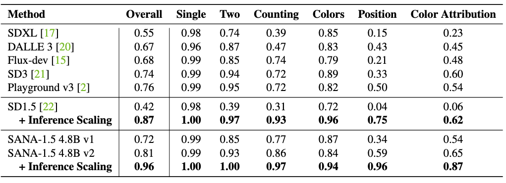
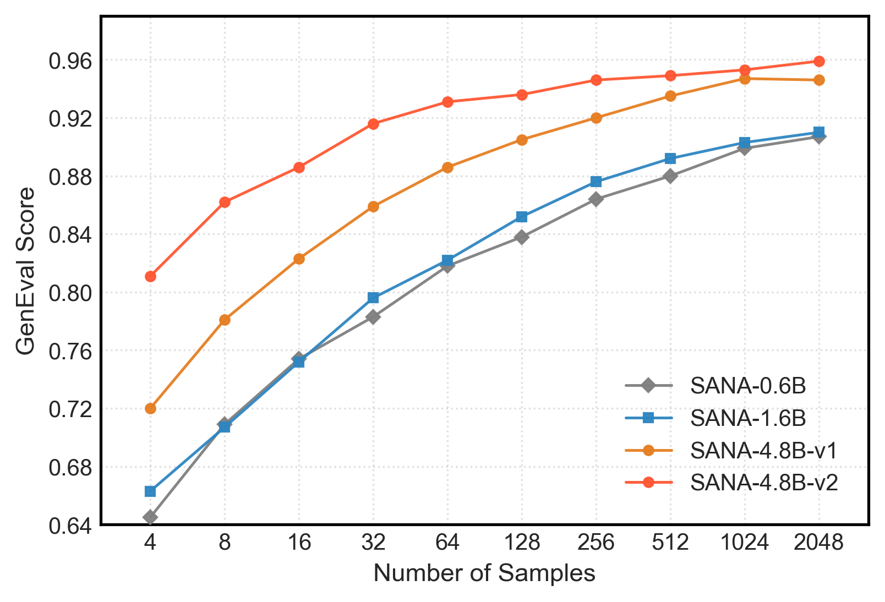

## Inference Time Scaling for SANA-1.5



We trained a specialized [NVILA-2B](https://huggingface.co/Efficient-Large-Model/NVILA-Lite-2B-Verifier) model to score images, which we named VISA (VIla as SAna verifier). By selecting the top 4 images from 2,048 candidates, we enhanced the GenEval performance of SD1.5 and SANA-1.5-4.8B v2, increasing their scores from 42 to 87 and 81 to 96, respectively.



Even for smaller number of candidates, like 32, we can also push the performance over 90% for SANA-1.5-4.8B v2 in the GenEval.

### Environment Requirement

Dependency setups:

```bash
# other transformers version may also work, but we have not tested
pip install transformers==4.46
pip install git+https://github.com/bfshi/scaling_on_scales.git
```

### 1. Generate N images with a .pth file for the following selection

```bash
# download the checkpoint for the following generation
huggingface-cli download Efficient-Large-Model/Sana_600M_512px --repo-type model --local-dir output/Sana_600M_512px --local-dir-use-symlinks False
# 32 is a relatively small number for test but can already push the geneval>90% when we verify the SANA-1.5-4.8B v2 model. Set it to larger number like 2048 for the limit of sky.
n_samples=32
pick_number=4

output_dir=output/geneval_generated_path
# example
bash scripts/infer_run_inference_geneval.sh \
    configs/sana_config/512ms/Sana_600M_img512.yaml \
    output/Sana_600M_512px/checkpoints/Sana_600M_512px_MultiLing.pth \
    --img_nums_per_sample=$n_samples \
    --output_dir=$output_dir
```

### 2. Use NVILA-Verifier to select from the generated images

```bash
bash tools/inference_scaling/nvila_sana_pick.sh \
    $output_dir \
    $n_samples \
    $pick_number
```

### 3. Calculate the GenEval metric

You need to use the GenEval environment for the final evaluation. The document about installation can be found [here](../../../tools/metrics/geneval/geneval_env.md).

```bash
# activate geneval env
conda activate geneval

DIR_AFTER_PICK="output/nvila_pick/best_${pick_number}_of_${n_samples}/${output_dir}"

bash tools/metrics/compute_geneval.sh $(dirname "$DIR_AFTER_PICK") $(basename "$DIR_AFTER_PICK")
```
